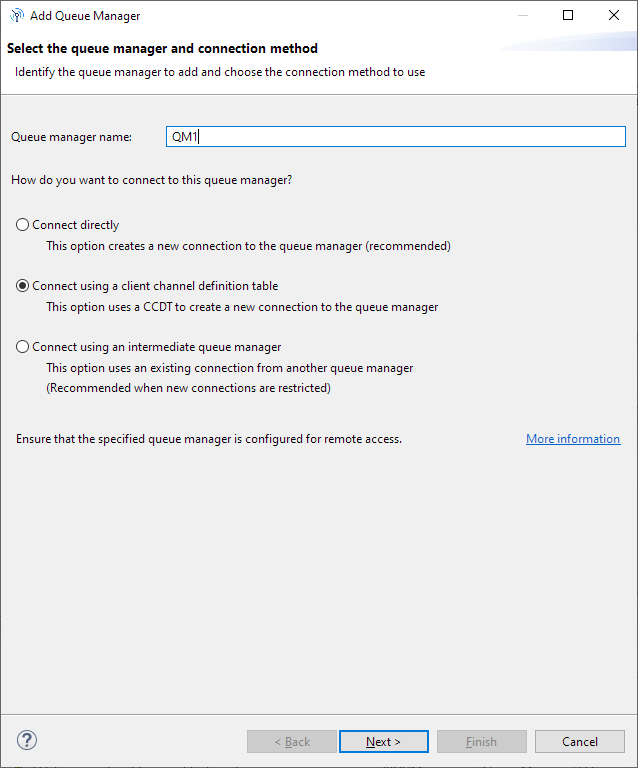
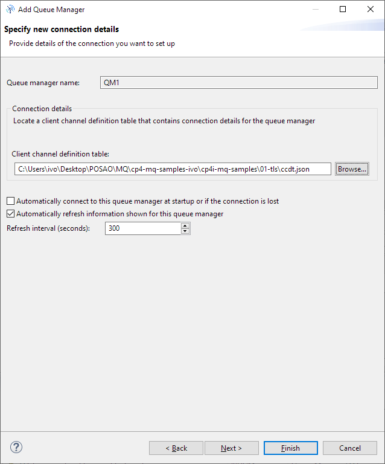
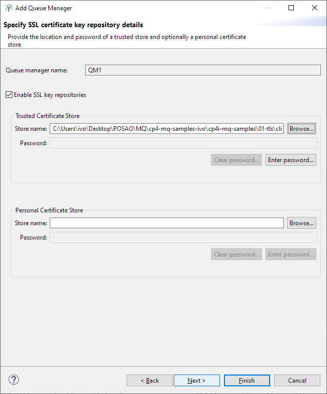
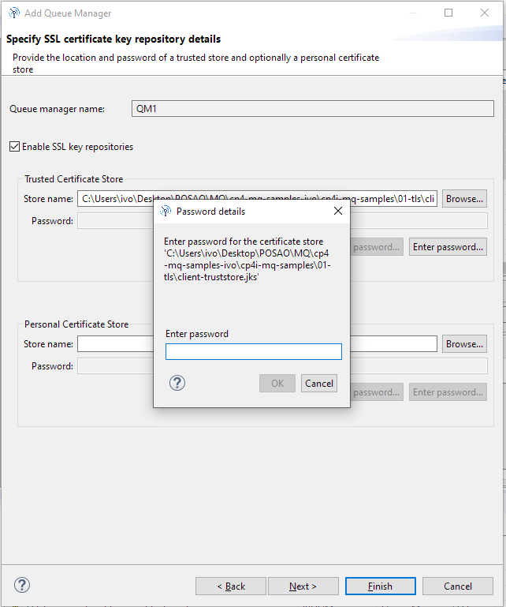

# Example: Configuring one-way TLS

Even with all security disabled, an MQ client cannot access a queue manager on CP4I without at least one-way TLS.

This example shows how to set up one-way TLS and deploy a queue manager to OpenShift. To test, we use the MQ sample clients `amqsputc` and `amqsgetc` to put and get messages from a queue.

Source: This is based on https://www.ibm.com/docs/en/ibm-mq/9.3?topic=manager-example-configuring-tls

## Preparation

Open a terminal and login to the OpenShift cluster where you installed the CP4I MQ Operator.

Clone this repository and navigate to this directory:

```
git clone https://github.com/isalkovic/cp4i-mq-samples.git

```

```
cd cp4i-mq-samples/01-tls

```

### Set Openshift project name
In the terminal, run the following command (or appropriate depending on your OS/environment):
```
export OCP_PROJECT=cp4i-mq-poc
```
Remember to change the name of the project to the actual Project name on Openshift, which you will be using.
You can check that the value is set properly by running the following command:
```
echo $OCP_PROJECT
```

### Clean up if not first time

Delete the files and OpenShift resources created by this example:

```
./cleanup-qm1.sh

```

# Configure and deploy the queue manager

You can copy/paste the commands shown here, or run the script [deploy-qm1-qmgr.sh](./deploy-qm1-qmgr.sh) which will execute all the commands automatically.

**Remember you must be logged in to your OpenShift cluster.**

## Setup TLS for the queue manager

### Create a private key and a self-signed certificate for the queue manager

```
openssl req -newkey rsa:2048 -nodes -keyout qm1.key -subj "//CN=qm1" -x509 -days 3650 -out qm1.crt

```
This command creates two files:

* Private key: `qm1.key`

* Certificate: `qm1.crt`

Check:

```
ls qm1.*

```

You should see:

```
qm1.crt	qm1.key
```

You can also inspect the certificate:

```
openssl x509 -text -noout -in qm1.crt

```

You'll see (truncated for redability):

```
Certificate:
    Data:
        Version: 1 (0x0)
        Serial Number: 13882868190759648755 (0xc0a9db109dcc7df3)
    Signature Algorithm: sha256WithRSAEncryption
        Issuer: CN=qm1
        Validity
            Not Before: Jul 21 09:15:33 2021 GMT
            Not After : Jul 19 09:15:33 2031 GMT
        Subject: CN=qm1
        Subject Public Key Info:
            Public Key Algorithm: rsaEncryption
                Public-Key: (2048 bit)
...
```

Note this is a self-signed certificate (Issuer is the same as Subject).

### Add the server public key to a client key database

#### Create the client key database:

The client key database will contain the queue manager certificate, so the client can verify the certificate that the queue manager sends during the TLS handshake.

```
runmqakm -keydb -create -db app1key.kdb -pw password -type cms -stash

```

This creates 4 files:

* Key database: `app1key.kdb`

* Revocation list: `app1key.crl`

* Certificate requests: `app1key.rdb`

* Password stash: `app1key.sth`. Used to pass the password (`"password"`) in commands instead of prompting the user.

#### Add the queue manager's certificate to the client key database:

```
runmqakm -cert -add -db app1key.kdb -label qm1cert -file qm1.crt -format ascii -stashed

```

To check, list the database certificates:

```
runmqakm -cert -list -db app1key.kdb -stashed

```

```
Certificates found
* default, - personal, ! trusted, # secret key
!	qm1cert
```

You can also get certificate details:

```
runmqakm -cert -details -db app1key.kdb -stashed -label qm1cert

```

### Configure TLS Certificates for Queue Manager

We create a kubernetes secret with the queue manager's certificate and private key. The secret will be used, when creating the queue manager, to populate the queue manager's key database.

```
oc create secret tls example-01-qm1-secret -n $OCP_PROJECT --key="qm1.key" --cert="qm1.crt"

```

## Setup and deploy the queue manager

### Create a config map containing MQSC commands

#### Create the config map yaml file
```
cat > qm1-configmap.yaml << EOF
apiVersion: v1
kind: ConfigMap
metadata:
  name: example-01-qm1-configmap
data:
  qm1.mqsc: |
    DEFINE QLOCAL('Q1') REPLACE DEFPSIST(YES)
    DEFINE CHANNEL(QM1CHL) CHLTYPE(SVRCONN) REPLACE TRPTYPE(TCP) SSLCAUTH(OPTIONAL) SSLCIPH('ANY_TLS12_OR_HIGHER')
    SET CHLAUTH(QM1CHL) TYPE(BLOCKUSER) USERLIST('nobody') ACTION(ADD)
EOF
#
cat qm1-configmap.yaml

```

#### Notes:

The MQSC statements above will run when the queue manager is created:

* Create a local queue called `Q1`. When testing, clients will put to and get from this queue.

* Create a Server Connection channel called `QM1CHL` with a TLS cipherspec (`ANY_TLS12_OR_HIGHER`) and optional TLS client authentication (`SSLCAUTH(OPTIONAL)`).

`SSLCAUTH(OPTIONAL)` makes the TLS connection one-way: the queue manager must send its certificate but the client doesn't have to.

* A Channel Authentication record that allows clients to connect to `QM1CHL` ("block nobody" reverses the CHLAUTH setting that blocks channels connections by default).

#### Create the config map

```
oc apply -n $OCP_PROJECT -f qm1-configmap.yaml

```

### Deploy the queue manager

#### Create the queue manager's yaml file:

```
cat > qm1-qmgr.yaml << EOF
apiVersion: mq.ibm.com/v1beta1
kind: QueueManager
metadata:
  name: qm1
spec:
  license:
    accept: true
    license: L-RJON-CD3JKX
    use: NonProduction
  queueManager:
    name: QM1
    mqsc:
    - configMap:
        name: example-01-qm1-configmap
        items:
        - qm1.mqsc
    storage:
      queueManager:
        type: ephemeral
  template:
    pod:
      containers:
        - env:
            - name: MQSNOAUT
              value: 'yes'
          name: qmgr
  version: 9.3.0.0-r2
  web:
    enabled: false
  pki:
    keys:
      - name: example
        secret:
          secretName: example-01-qm1-secret
          items:
          - tls.key
          - tls.crt
EOF
#
cat qm1-qmgr.yaml

```

#### Notes:

* Version:

```
  version: 9.3.0.0-r2

```

The MQ version depends on the OpenShift MQ Operator version. To find out your MQ Operator version:

See [Version support for the IBM MQ Operator](https://www.ibm.com/docs/en/ibm-mq/9.3?topic=operator-version-support-mq) for a list of MQ versions supported by this MQ Operator version.

* License:

```
  license:
    accept: true
    license: L-RJON-CD3JKX
    use: NonProduction
```

The license is correct for the MQ version. If you are installing a different MQ version, you'll find the correct license in [Licensing reference for mq.ibm.com/v1beta1](https://www.ibm.com/docs/en/ibm-mq/9.3?topic=mqibmcomv1beta1-licensing-reference).

* MQSC statements:

```
    mqsc:
    - configMap:
        name: example-01-qm1-configmap
        items:
        - qm1.mqsc
```

The above points to the configmap with MQSC statements we created earlier. The MQSC statements will run when the queue manager is deployed.

* No user authentication:

```
        - env:
            - name: MQSNOAUT
              value: 'yes'
```

Setting the environment variable `MQSNOAUT=yes` disables user authentication (clients don't have to provide userid and password when connecting, and user authority to access resources is not checked). In CP4I, non-production queue managers have this setting by default.

* MQ Web Console:

```
  web:
    enabled: false
```

In Cloud Pak for Integration, the MQ Web Console is accessed from Platform Navigator. We are using the minimum configuration needed to run a queue manager, so are setting this to `enabled: false`. If you enable this setting to use the MQ Web Console, you must install the Cloud Pak for Integration operator and create an instance of Platform Navigator.

* Queue manager key and certificate:

```
  pki:
    keys:
      - name: example
        secret:
          secretName: example-01-qm1-secret
          items:
          - tls.key
          - tls.crt
```

The `pki` section points to the secret (created earlier) containing the queue manager's certificate and private key.

#### Create the queue manager

```
oc apply -n $OCP_PROJECT -f qm1-qmgr.yaml

```

# Connecting the MQ Explorer to the Q manager

If you would like to connect your MQ Explorer tool to this queue manager, follow these steps.

## Add remote QMGR to MQ Explorer

1. Start MQ Explorer.

2. Right-click on `Queue Managers` (top left) and select `Add Remote Queue Manager...`

3. Enter the queue manager name (`QM1`, case sensitive) and select the `Connect using a client channel definition table` radio button. Click `Next`.



4. On the next pane (`Specify new connection details`), click `Browse...` and select the file `ccdt.json` just created. Click `Next`.



5. On `Specify SSL certificate key repository details`, tick `Enable SSL key repositories`.

5.1. On `Trusted Certificate Store` click on `Browse...` and select the file `client-truststore.jks`.



5.2. Select `Enter password...` and enter the trust store password (in our case, `password`).



5.3. On `Specify SSL Option Detail` click on the `Finish` button.


You should now have a connection to your QMGR deployed on Openshift.

# Set up and run the clients

We will put, browse and get messages to test the queue manager we just deployed.

You can copy/paste the commands shown below to a command line, or use these scripts:

* [run-qm1-client-put.sh](./run-qm1-client-put.sh) to put two test messages to the queue `Q1`.
* [run-qm1-client-browse.sh](./run-qm1-client-browse.sh) to browse the messages (read them but leave them on the queue).
* [run-qm1-client-get.sh](./run-qm1-client-get.sh) to get messages (read them and remove them from the queue).

## Test the connection

### Confirm that the queue manager is running

It takes 2-5 minutes for the queue manager state to go from "Pending" to "Running".

```
oc get qmgr -n $OCP_PROJECT qm1

```

### Find the queue manager host name

The client needs this to specify the host to connec to.

```
qmhostname=`oc get route -n $OCP_PROJECT qm1-ibm-mq-qm -o jsonpath="{.spec.host}"`
echo $qmhostname

```

Test (optional):
```
curl --insecure https://$qmhostname

```
If you get a message
```
curl: (52) Empty reply from server
```
this means that the connection to the server has been established.


### Create `ccdt.json` (Client Channel Definition Table)

The CCDT tells the client where the queue manager is (host and port), the channel name, and the TLS cipher (encryption and signing algorithms) to use.

For details, see [Configuring a JSON format CCDT](https://www.ibm.com/docs/en/ibm-mq/9.3?topic=tables-configuring-json-format-ccdt).

```
cat > ccdt.json << EOF
{
    "channel":
    [
        {
            "name": "QM1CHL",
            "clientConnection":
            {
                "connection":
                [
                    {
                        "host": "$qmhostname",
                        "port": 443
                    }
                ],
                "queueManager": "QM1"
            },
            "transmissionSecurity":
            {
              "cipherSpecification": "ANY_TLS12_OR_HIGHER"
            },
            "type": "clientConnection"
        }
   ]
}
EOF
#
cat ccdt.json

```
#### Note:

```
            "transmissionSecurity":
            {
              "cipherSpecification": "ANY_TLS12_OR_HIGHER"
            },
```

The above enables TLS on the connection. It sets a cipher specification (`ANY_TLS12_OR_HIGHER`) that negotiates the highest level of security that the remote end will allow but will only connect using a TLS 1.2 or higher protocol. For details, see [Enabling CipherSpecs](https://www.ibm.com/docs/en/ibm-mq/9.3?topic=messages-enabling-cipherspecs).

### Export environment variables

We set two environment variables:

* `MQCCDTURL` points to `ccdt.json`.

* `MQSSLKEYR` points to the key database. ***Note this must be the file name without the `.kdb` extension***.

```
export MQCCDTURL=ccdt.json
export MQSSLKEYR=app1key
# check:
echo MQCCDTURL=$MQCCDTURL
ls -l $MQCCDTURL
echo MQSSLKEYR=$MQSSLKEYR
ls -l $MQSSLKEYR.*

```

#### Notes

For `MQCCDTURL`, we use the simplest form that works in this situation (the CCDT is in the directory where the clients run). Other valid forms are:

* Full path:

```
export MQCCDTURL=`pwd`/ccdt.json
```

* Full path (resolving symlinks):

```
thisDir="$( cd "$( dirname "${BASH_SOURCE[0]}" )" &> /dev/null && pwd )"
export MQCCDTURL="${thisDir}/ccdt.json"
```

* File URL format

```
export MQCCDTURL=file://`pwd`/ccdt.json
```

Same for `MQSSLKEYR`. It is also possible to use the full path to the key database:

```
export MQSSLKEYR=`pwd`/app1key
```

### Put messages to the queue

```
echo "Test message 1" | amqsputc Q1 QM1
echo "Test message 2" | amqsputc Q1 QM1

```

You should see:

```
Sample AMQSPUT0 start
target queue is Q1
Sample AMQSPUT0 end
Sample AMQSPUT0 start
target queue is Q1
Sample AMQSPUT0 end
```

### Get messages from the queue

The program gets and displays the messages and waits for more. Ends after 15 seconds if no more messages:

```
amqsgetc Q1 QM1

```

You should see:

```
Sample AMQSGET0 start
message <Test message 1>
message <Test message 2>
no more messages
Sample AMQSGET0 end
```

## Cleanup

This deletes the queue manager and other objects created on OpenShift, and the files created by this example:

```
./cleanup-qm1.sh

```

## Next steps

Next, we'll try to implement mutual TLS. See [02-mtls](../02-mtls).
