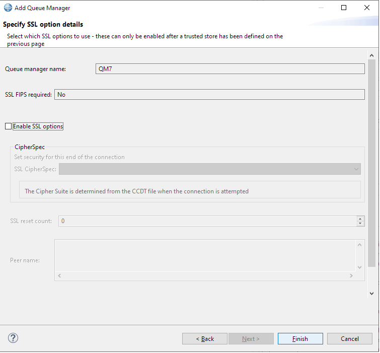

# Example: Conencting MQ Explorer and rfhutil to QMGR on Openshift

This is a modified example of the original, which shows how to connect MQ Explorer to MQ running on Openshift, when using HOSTNAME instead of CHANNEL in the route. It is based on the [03-auth](../03-auth) example: the connection requires mutual TLS and user permissions are checked. The user identity is `mqx1` instead of `app1`.
Additionally, example has been extended to show how to configure the popular rfhutil tool with the same MQ Queue manager, running on openshift and using mTLS. There are two versions of the rfhutil tool - rfhutil.exe and rfhutilc.exe -> make sure you download and use the RFHUTILC.EXE, which is the one using the MQ client and making a connection to a remote QM.

***Note:*** at the time of writing, this example doesn't work on MacOS.

## Preparation

Open a terminal and login to the OpenShift cluster where you installed the CP4I MQ Operator.

If not already done, clone this repository and navigate to this directory:

```
git clone https://github.com/isalkovic/cp4i-mq-samples.git

```

```
cd cp4i-mq-samples/07-mqx

```
### Set Openshift project name
In the terminal, run the following command (or appropriate depending on your OS/environment):
```
export OCP_PROJECT=cp4i-mq-poc
```

Remember to change the name of the project to the actual Project name on Openshift, which you will be using.
You can check that the value is set properly by running the following command:
```
echo $OCP_PROJECT
```

### Clean up if not first time

Delete the files and OpenShift resources created by this example:

```
./cleanup-qm7.sh

```

# Configure and deploy the queue manager

You can copy/paste the commands shown here, or run the script [deploy-qm7-qmgr.sh](./deploy-qm7-qmgr.sh).

**Remember you must be logged in to your OpenShift cluster.**

## Setup TLS for the queue manager

### Create a private key and a self-signed certificate for the queue manager

```
openssl req -newkey rsa:2048 -nodes -keyout qm7.key -subj "//CN=qm7" -x509 -days 3650 -out qm7.crt

```

## Setup TLS for MQ Explorer

MQ Explorer is a Java application. Java applications use a different type of key store, called `JKS`. In JKS, there are two stores:

* Trust store: this will contain the queue manager's signer (CA) certificate. In this case, as the queue manager's certificate is self-signed, the trust store will contain the queue manager's certificate itself.

* Key store: this will contain the client's (that is, MQ Explorer's) certificate and private key.

### Import the Queue Manager's certificate into a JKS trust store

This will create a file called `mqx1-truststore.jks`.

```
keytool -importcert -file qm7.crt -alias qm7cert -keystore mqx1-truststore.jks -storetype jks -storepass password -noprompt

```

### IVO:: import also APIS certificates to client's JKS trust store
Before running the following commands, make sure you have acquired the root certificate and that it is available with the name referenced in the command:
```
keytool -keystore mqx1-truststore.jks -storetype jks -import -file APIS_root_certificate.crt -alias apisrootcert -storepass password -noprompt
```

List the trust store certificate:

```
keytool -list -keystore mqx1-truststore.jks -storepass password

```

Output should be similar to this (truncated for readability; ignore the warning about proprietary format):

```
qm7cert, 7 Dec 2021, trustedCertEntry,
Certificate fingerprint (SHA-256): 96:62:71:B8:46:AE:48:A0:02:E0:74:BD...
apisrootcert, 20. ruj 2022., trustedCertEntry,
Certificate fingerprint (SHA-256): F1:E7:73:46:E4:FC:E0:34:83:E3:94:9D:...
qm7cert, 20. ruj 2022., trustedCertEntry,
Certificate fingerprint (SHA-256): E8:A4:E1:08:ED:00:A9:57:E9:59:F9:75:...


```

### Create a private key and a self-signed certificate for MQ Explorer

```
openssl req -newkey rsa:2048 -nodes -keyout mqx1.key -subj "//CN=mqx1" -x509 -days 3650 -out mqx1.crt

```

#### Add MQ Explorer's certificate and key to a JKS key store

First, put the key (`mqx1.key`) and certificate (`mqx1.crt`) into a PKCS12 file. PKCS12 is a format suitable for importing into the JKS key store (`mqx1-keystore.jks`):

```
openssl pkcs12 -export -out mqx1.p12 -inkey mqx1.key -in mqx1.crt -name mqx1 -password pass:password

```

Next, import the PKCS12 file into a JKS store (this creates the key store; ignore the warning about proprietary format):

```
keytool -importkeystore -deststorepass password -destkeypass password -destkeystore mqx1-keystore.jks -deststoretype jks -srckeystore mqx1.p12 -srcstoretype PKCS12 -srcstorepass password -alias mqx1

```

List the key store certificate:

```
keytool -list -keystore mqx1-keystore.jks -alias mqx1 -storepass password

```

Output should be similar to this (truncated for readability; ignore the warning about proprietary format):

```
mqx1, 7 Dec 2021, PrivateKeyEntry,
Certificate fingerprint (SHA-256): 95:17:91:9C:09:A1:64:5D:23:AF:66:BA...

```

## Setup TLS for rfhutil tool

Now, we also need to package these keys and certificates to a CMS .kdb keystore/truststore, which is a formate required by rfhutilc.exe tool
First, create the store:

```
runmqakm -keydb -create -db rfhutil_allin1_store.kdb -pw password -type cms -stash

```

Next, add the queue manager public key to the client key database:

```
runmqakm -cert -add -db rfhutil_allin1_store.kdb -label qm1cert -file qm7.crt -format ascii -stashed

```
Also, we need to import APIS root certificate to client's CMS trust store

```
runmqakm -cert -add -db rfhutil_allin1_store.kdb -label apisrootcert -file APIS_root_certificate.crt -format ascii -stashed

```

Next, add the client's certificate and key to the client key database:
Import the PKCS12 file. The label **must be** `ibmwebspheremq<your userid>`:

```
label=ibmwebspheremq`id -u -n`
runmqakm -cert -import -target rfhutil_allin1_store.kdb -file mqx1.p12 -target_stashed -pw password -new_label $label

```

Last Checkpoint. List the database certificates:

```
runmqakm -cert -list -db rfhutil_allin1_store.kdb -stashed

```

### Create TLS Secret for the Queue Manager

```
oc create secret tls example-07-qm7-secret -n $OCP_PROJECT --key="qm7.key" --cert="qm7.crt"

```

### Create TLS Secret with the client's certificate

```
oc create secret generic example-07-mqx1-secret -n $OCP_PROJECT --from-file=mqx1.crt=mqx1.crt

```

## Setup and deploy the queue manager

### Create a config map containing MQSC commands and qm.ini

#### Create the config map yaml file

The specific here is the we need to set "OutboundSNI=HOSTNAME" in the .ini file.

```
cat > qm7-configmap.yaml << EOF
apiVersion: v1
kind: ConfigMap
metadata:
  name: example-07-qm7-configmap
data:
  qm7.mqsc: |
    DEFINE CHANNEL(QM7CHL) CHLTYPE(SVRCONN) REPLACE TRPTYPE(TCP) SSLCAUTH(REQUIRED) SSLCIPH('ANY_TLS12_OR_HIGHER')
    ALTER AUTHINFO(SYSTEM.DEFAULT.AUTHINFO.IDPWOS) AUTHTYPE(IDPWOS) CHCKCLNT(OPTIONAL)
    SET CHLAUTH('QM7CHL') TYPE(SSLPEERMAP) SSLPEER('CN=mqx1') USERSRC(MAP) MCAUSER('mqx1') ACTION(ADD)
    SET AUTHREC PROFILE('SYSTEM.ADMIN.COMMAND.QUEUE')    OBJTYPE(QUEUE) PRINCIPAL('mqx1') AUTHADD(DSP, INQ, PUT)
    SET AUTHREC PROFILE('SYSTEM.MQEXPLORER.REPLY.MODEL') OBJTYPE(QUEUE) PRINCIPAL('mqx1') AUTHADD(DSP, INQ, GET, PUT)
    SET AUTHREC PROFILE('**') OBJTYPE(AUTHINFO) PRINCIPAL('mqx1') AUTHADD(ALLADM, CRT)
    SET AUTHREC PROFILE('**') OBJTYPE(CHANNEL)  PRINCIPAL('mqx1') AUTHADD(ALLADM, CRT)
    SET AUTHREC PROFILE('**') OBJTYPE(CLNTCONN) PRINCIPAL('mqx1') AUTHADD(ALLADM, CRT)
    SET AUTHREC PROFILE('**') OBJTYPE(COMMINFO) PRINCIPAL('mqx1') AUTHADD(ALLADM, CRT)
    SET AUTHREC PROFILE('**') OBJTYPE(LISTENER) PRINCIPAL('mqx1') AUTHADD(ALLADM, CRT)
    SET AUTHREC PROFILE('**') OBJTYPE(NAMELIST) PRINCIPAL('mqx1') AUTHADD(ALLADM, CRT)
    SET AUTHREC PROFILE('**') OBJTYPE(PROCESS)  PRINCIPAL('mqx1') AUTHADD(ALLADM, CRT)
    SET AUTHREC PROFILE('**') OBJTYPE(QUEUE)    PRINCIPAL('mqx1') AUTHADD(ALLADM, CRT, ALLMQI)
    SET AUTHREC               OBJTYPE(QMGR)     PRINCIPAL('mqx1') AUTHADD(ALLADM, CONNECT, INQ)
    SET AUTHREC PROFILE('**') OBJTYPE(RQMNAME)  PRINCIPAL('mqx1') AUTHADD(ALLADM, CRT)
    SET AUTHREC PROFILE('**') OBJTYPE(SERVICE)  PRINCIPAL('mqx1') AUTHADD(ALLADM, CRT)
    SET AUTHREC PROFILE('**') OBJTYPE(TOPIC)    PRINCIPAL('mqx1') AUTHADD(ALLADM, CRT, ALLMQI)
  qm7.ini: |-
    Service:
      Name=AuthorizationService
      EntryPoints=14
      SecurityPolicy=UserExternal
    SSL:
      OutboundSNI=HOSTNAME
EOF
#
cat qm7-configmap.yaml

```

#### Note:

* SET AUTHREC commands

```
    SET AUTHREC PROFILE('SYSTEM.ADMIN.COMMAND.QUEUE')    OBJTYPE(QUEUE) PRINCIPAL('mqx1') AUTHADD(DSP, INQ, PUT)
    SET AUTHREC PROFILE('SYSTEM.MQEXPLORER.REPLY.MODEL') OBJTYPE(QUEUE) PRINCIPAL('mqx1') AUTHADD(DSP, INQ, GET, PUT)
    SET AUTHREC PROFILE('**') OBJTYPE(AUTHINFO) PRINCIPAL('mqx1') AUTHADD(ALLADM, CRT)
    SET AUTHREC PROFILE('**') OBJTYPE(CHANNEL)  PRINCIPAL('mqx1') AUTHADD(ALLADM, CRT)
    SET AUTHREC PROFILE('**') OBJTYPE(CLNTCONN) PRINCIPAL('mqx1') AUTHADD(ALLADM, CRT)
    SET AUTHREC PROFILE('**') OBJTYPE(COMMINFO) PRINCIPAL('mqx1') AUTHADD(ALLADM, CRT)
    SET AUTHREC PROFILE('**') OBJTYPE(LISTENER) PRINCIPAL('mqx1') AUTHADD(ALLADM, CRT)
    SET AUTHREC PROFILE('**') OBJTYPE(NAMELIST) PRINCIPAL('mqx1') AUTHADD(ALLADM, CRT)
    SET AUTHREC PROFILE('**') OBJTYPE(PROCESS)  PRINCIPAL('mqx1') AUTHADD(ALLADM, CRT)
    SET AUTHREC PROFILE('**') OBJTYPE(QUEUE)    PRINCIPAL('mqx1') AUTHADD(ALLADM, CRT, ALLMQI)
    SET AUTHREC               OBJTYPE(QMGR)     PRINCIPAL('mqx1') AUTHADD(ALLADM, CONNECT, INQ)
    SET AUTHREC PROFILE('**') OBJTYPE(RQMNAME)  PRINCIPAL('mqx1') AUTHADD(ALLADM, CRT)
    SET AUTHREC PROFILE('**') OBJTYPE(SERVICE)  PRINCIPAL('mqx1') AUTHADD(ALLADM, CRT)
    SET AUTHREC PROFILE('**') OBJTYPE(TOPIC)    PRINCIPAL('mqx1') AUTHADD(ALLADM, CRT, ALLMQI)
```

These commands give user `mqx1` full administrative rights. They are based on the `setmqaut` commands documented in [Granting full administrative access to all resources on a queue manager](https://www.ibm.com/docs/en/ibm-mq/9.3?topic=grar-granting-full-administrative-access-all-resources-queue-manager).

#### Create the config map

```
oc apply -n $OCP_PROJECT -f qm7-configmap.yaml

```


### Deploy the queue manager

#### Create the queue manager's yaml file

```
cat > qm7-qmgr.yaml << EOF
apiVersion: mq.ibm.com/v1beta1
kind: QueueManager
metadata:
  name: qm7
spec:
  license:
    accept: true
    license: L-RJON-C7QG3S
    use: NonProduction
  queueManager:
    name: QM7
    ini:
      - configMap:
          name: example-07-qm7-configmap
          items:
            - qm7.ini
    mqsc:
    - configMap:
        name: example-07-qm7-configmap
        items:
        - qm7.mqsc
    storage:
      queueManager:
        type: ephemeral
  version: 9.2.5.0-r3
  web:
    enabled: false
  pki:
    keys:
      - name: example
        secret:
          secretName: example-07-qm7-secret
          items:
          - tls.key
          - tls.crt
    trust:
    - name: mqx1
      secret:
        secretName: example-07-mqx1-secret
        items:
          - mqx1.crt
EOF
#
cat qm7-qmgr.yaml

```
#### Create the queue manager

```
oc apply -n $OCP_PROJECT -f qm7-qmgr.yaml

```

### Confirm that the queue manager is running

```
oc get qmgr -n $OCP_PROJECT qm7

```

## Create the Channel Table (CCDT) for MQ Explorer

### Find the queue manager host name

```
qmhostname=`oc get route -n $OCP_PROJECT qm7-ibm-mq-qm -o jsonpath="{.spec.host}"`
echo $qmhostname

```

Test (optional):
```
nslookup $qmhostname

```

### Create ccdt.json

```
cat > ccdt.json << EOF
{
    "channel":
    [
        {
            "name": "QM7CHL",
            "clientConnection":
            {
                "connection":
                [
                    {
                        "host": "$qmhostname",
                        "port": 443
                    }
                ],
                "queueManager": "QM7"
            },
            "transmissionSecurity":
            {
              "cipherSpecification": "ANY_TLS12_OR_HIGHER"
            },
            "type": "clientConnection"
        }
   ]
}
EOF
#
cat ccdt.json

```


# Connect MQ Explorer

## Define mqclient.ini file

As the last step before starting and configuring MQ Explorer, we need to tell MQ Explorer to connect to the MQ server using HOSTNAME, instead of CHANNEL (default is CHANNEL).
To do so, we need to create a mqclient.ini file and put it on one of the location where it will be found. It must contain at least the following content:

```
SSL:
   AllowTLSV13=TRUE
   OutboundSNI=HOSTNAME
```
For location of the mqclient.ini file on Windows, I have used "C:\ProgramData\IBM\MQ".
Other possible locations are specified in MQ documentation:
https://www.ibm.com/docs/en/ibm-mq/9.3?topic=file-location-client-configuration

An example mqclient.ini file is provided along with this documentation.

## Add remote QMGR to MQ Explorer

1. Start MQ Explorer.

2. Right-click on `Queue Managers` (top left) and select `Add Remote Queue Manager...`


3. Enter the queue manager name (`QM7`, case sensitive) and select the `Connect using a client channel definition table` radio button. Click `Next`.


4. On the next pane (`Specify new connection details`), click `Browse...` and select the file `ccdt.json` just created. Click `Next`.


5. On `Specify SSL certificate key repository details, tick `Enable SSL key repositories`.

5.1. On `Trusted Certificate Store` click on `Browse...` and select the file `mqx1-truststore.jks`.


5.2. Select `Enter password...` and enter the trust store password (in our case, `password`).


5.3. On `Personal Certificate Store` click on `Browse...` and select the file `mqx1-keystore.jks`.

5.4. Select `Enter password...` and enter the key store password (in our case, `password`).

Click `Finish`.



You should now have a connection to your QMGR deployed on Openshift.

## Configure rfhutilc.exe to connect to the QMgr

1. Start the rfhutilc.exe.

2. Fill in the fields `Queue manager name` and `Queue name` as indicated on the image below.

3. Click on the `Set Conn Id` button and fill the form as indicated on the image below (reference your .kdb file location)


4. To test, you can push the `Write Q` button. If you get the message similar to "Message sent to TEST length=0" -> this means you have successfully configured your rfhutilc tool.

## Cleanup

This deletes the queue manager and other objects created on OpenShift, and the files created by this example:

```
./cleanup-qm7.sh

```

This is the end of this tutorial for MQ Explorer and rfhutil configuration.
