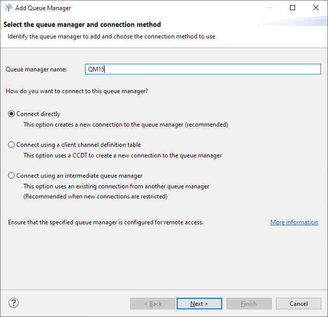
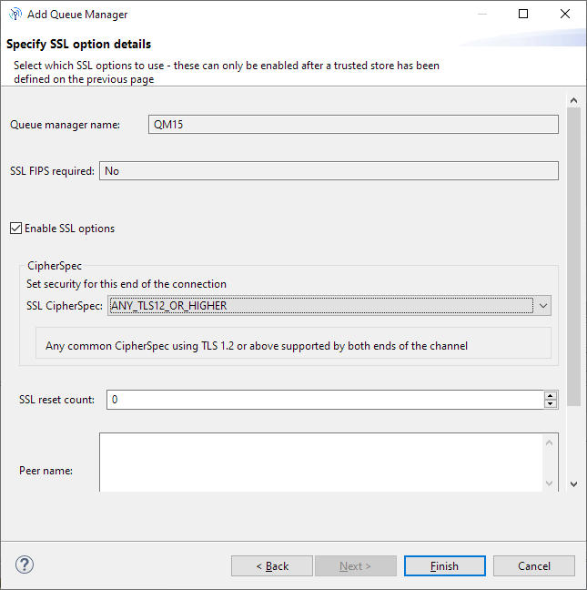

# Example: Adding user authentication using LDAP

This example deploys a queue manager that requires clients and administrators to authenticate using an LDAP server.


This example shows two basic access types to MQ:
1. **Administration perspective**

How to connect MQ Explorer to MQ running on Openshift, when using an LDAP user which belongs to "admins" group. This group is configured to have full administrative rights on the queue manager. The connection requires one way TLS.

2. **End-user / client application perspective**

How to connect to an MQ running on Openshift, when using an LDAP user which belongs to "users" group, which gives it authorization to connecto to queue manager. The user is also authorized to write/read to a specific queue.
The client application connection is tested using a Java JMS application and using the popular rfhutilc.exe tool.
The connection requires one way TLS.

## Preparation

If not already done, clone (or download as zip) this repository and navigate to the directory where the repository is downloaded:

```
git clone https://github.com/isalkovic/cp4i-mq-samples.git

```

```
cd cp4i-mq-samples/15-ldap

```

Open a terminal and login to the OpenShift cluster where you installed the CP4I MQ Operator.

### Set Openshift project name

Open the scripts "deploy-qm15-qmgr.sh" and "cleanup-qm15.sh" and edit the line 10 to match your Openshift project name.
Also, set your command line environment variable to the value of your Openshift project name:

```
export OCP_PROJECT=cp4i-mq-poc
```

### Clean up your work, if not running for the first time

Delete the files and OpenShift resources created previously by this example:

```
./cleanup-qm15.sh

```

# Configure and deploy the queue manager

You can copy/paste the commands shown here to go step-by-step (suggested for first time to better understand the process), or simply run the [deploy-qm15-qmgr.sh](./deploy-qm15-qmgr.sh) script to execute all the commands automatically.

**Remember that you must be logged in to your OpenShift cluster.**

## Setup TLS for the queue manager

### Create a private key and a self-signed certificate for the queue manager

For the purpose of this demonstration we are going to create a self-signed certificate for our Queue manager. For real life scenarios, this would typically be a certificate issued and signed by a recognised certificate authority.

```
openssl req -newkey rsa:2048 -nodes -keyout qm15.key -subj "//CN=qm15" -x509 -days 3650 -out qm15.crt

```

## Setup TLS for MQ Explorer and the JMS Java Client application

Java applications use a different type of key store, called `JKS`. In JKS, there are two stores:

* **Trust store**: it will contain the queue manager's signer (CA) certificate. In this case, as the queue manager's certificate is self-signed, the trust store will contain the queue manager's certificate itself. Additionally, we should include also root and other certificates in the chain.

* **Key store**: since we will be using one way TLS, we will not be generating client certificates and we will not need a keystore

### Import the Queue Manager's certificate into a JKS trust store

This command will create a file called `mqx1-truststore.jks`.

```
keytool -importcert -file qm15.crt -alias qm15cert -keystore mqx1-truststore.jks -storetype jks -storepass password -noprompt

```

### Next, import also any root/internal and other required certificates to client's JKS trust store
Before running the following commands, make sure you have acquired the root/other certificates and that it is available with the name referenced in the command:
```
keytool -keystore mqx1-truststore.jks -storetype jks -import -file YOUR_CERTIFICATE_NAME.crt -alias apisrootcert -storepass password -noprompt
```

Repeat the above command for every certificate required to complete the full certificate chain.

List the trust store certificate to check that all required certificates have been added to the truststore:

```
keytool -list -keystore mqx1-truststore.jks -storepass password

```

Output should be similar to this (truncated for readability; ignore the warning about proprietary format):

```
apisrootcert, 20. ruj 2022., trustedCertEntry,
Certificate fingerprint (SHA-256): F1:E7:73:46:E4:FC:E0:34:83:E3:94:9D:...
qm15cert, 20. ruj 2022., trustedCertEntry,
Certificate fingerprint (SHA-256): E8:A4:E1:08:ED:00:A9:57:E9:59:F9:75:...
```

## Setup TLS for rfhutil tool

Now, we also need to package these certificates to a CMS .kdb truststore, which is a format required by rfhutilc.exe tool
First, create the store:

```
runmqakm -keydb -create -db app1key.kdb -pw password -type cms -stash

```

Next, add the queue manager public key to the client key database:

```
runmqakm -cert -add -db app1key.kdb -label qm15cert -file qm15.crt -format ascii -stashed

```
Also, same like with the JKS truststore, we need to import any root/other certificate to client's CMS trust store

```
runmqakm -cert -add -db app1key.kdb -label apisrootcert -file YOUR_CERTIFICATE_NAME.crt -format ascii -stashed

```

Repeat the above command for every certificate required to complete the full certificate chain.


Last Checkpoint. List the store certificates:

```
runmqakm -cert -list -db app1key.kdb -stashed

```

### Create TLS Secret for the Queue Manager, on Openshift

```
oc create secret tls example-15-qm15-secret -n $OCP_PROJECT --key="qm15.key" --cert="qm15.crt"

```


## Setup and deploy the queue manager

### Create a config map containing MQSC commands and qm.ini

#### Create the config map yaml file

The specific here is that we are configuring an LDAP connection (**!!!password hidden and needs to be updated before using!!!**) on the queue manager level, creating a separate channel ( QM15CHL ) for client application communication, and setting authorization for two LDAP groups - "users" and "admins". On the LDAP server, these two groups are defined and they contain users "user1" and "user2" in "users" group and "admin1" and "admin2" in "admins" group. Specific authorizations have been set for "user1" and "user2" so that we can demonstrate and test different privileges. Specific configuration lines will be explained in the text below.

Execute the following command to create the configmap YAML file:

```
cat > qm15-configmap.yaml << EOF
apiVersion: v1
kind: ConfigMap
metadata:
  name: example-15-qm15-configmap
data:
  qm15.mqsc: |
    DEFINE AUTHINFO(QM15.IDPW.LDAP) AUTHTYPE(IDPWLDAP) CONNAME('ldap01hz.razvoj.gzaop.local(33389)') SHORTUSR('uid') ADOPTCTX(YES) AUTHORMD(SEARCHGRP) BASEDNG('ou=groups,ou=applications,serialNumber=18683136487-CURH,o=gov,C=HR') BASEDNU('ou=users,ou=applications,serialNumber=18683136487-CURH,o=gov,C=HR') CHCKCLNT(OPTIONAL) CHCKLOCL(NONE) CLASSGRP('accessGroup') CLASSUSR('inetOrgPerson') FINDGRP('member') GRPFIELD('cn') LDAPPWD('*******') LDAPUSER('uid=CURH_reader,ou=AAA-users,ou=users,o=apis-it,c=HR') NESTGRP(YES) SECCOMM(NO) USRFIELD('uid')
    ALTER QMGR CONNAUTH(IVOQM.IDPW.LDAP)
    DEFINE CHANNEL(QM15CHL) CHLTYPE(SVRCONN) REPLACE TRPTYPE(TCP) SSLCAUTH(OPTIONAL) SSLCIPH('ANY_TLS12_OR_HIGHER')
    SET CHLAUTH('QM15CHL') TYPE(ADDRESSMAP) ADDRESS('*') USERSRC(CHANNEL) DESCR('sve adrese, user sa kanala, obavezno user i pass provjera') CHCKCLNT(REQUIRED) ACTION(ADD)
    refresh security
    DEFINE QLOCAL('TEST1') REPLACE DEFPSIST(YES)
    DEFINE QLOCAL('TEST2') REPLACE DEFPSIST(YES)
    SET AUTHREC GROUP('users') OBJTYPE(QMGR) AUTHADD(CONNECT,INQ)
    SET AUTHREC PROFILE('TEST1') PRINCIPAL('user1') OBJTYPE(QUEUE) AUTHADD(BROWSE,GET,INQ,PUT)
    SET AUTHREC PROFILE('TEST1') PRINCIPAL('user2') OBJTYPE(QUEUE) AUTHADD(PUT)
    SET AUTHREC PROFILE('TEST2') PRINCIPAL('user1') OBJTYPE(QUEUE) AUTHADD(PUT)
    SET AUTHREC PROFILE('TEST2') PRINCIPAL('user2') OBJTYPE(QUEUE) AUTHADD(GET)
    refresh security
    DEFINE CHANNEL(SYSTEM.ADMIN.SVRCONN) CHLTYPE(SVRCONN) REPLACE TRPTYPE(TCP) SSLCAUTH(OPTIONAL) SSLCIPH('ANY_TLS12_OR_HIGHER')
    SET CHLAUTH('SYSTEM.ADMIN.SVRCONN') TYPE(ADDRESSMAP) ADDRESS('*') USERSRC(CHANNEL) DESCR('Administration channel') CHCKCLNT(REQUIRED) ACTION(REPLACE)
    SET AUTHREC PROFILE('SYSTEM.ADMIN.COMMAND.QUEUE')    OBJTYPE(QUEUE) GROUP('admins') AUTHADD(DSP, INQ, PUT)
    SET AUTHREC PROFILE('SYSTEM.DEFAULT.MODEL.QUEUE')    OBJTYPE(QUEUE) GROUP('admins') AUTHADD(DSP, INQ, BROWSE, GET)
    SET AUTHREC PROFILE('SYSTEM.MQEXPLORER.REPLY.MODEL') OBJTYPE(QUEUE) GROUP('admins') AUTHADD(DSP, INQ, GET, PUT, BROWSE)
    SET AUTHREC PROFILE('**') OBJTYPE(AUTHINFO) GROUP('admins') AUTHADD(ALLADM, CRT)
    SET AUTHREC PROFILE('**') OBJTYPE(CHANNEL)  GROUP('admins') AUTHADD(ALLADM, CRT)
    SET AUTHREC PROFILE('**') OBJTYPE(CLNTCONN) GROUP('admins') AUTHADD(ALLADM, CRT)
    SET AUTHREC PROFILE('**') OBJTYPE(COMMINFO) GROUP('admins') AUTHADD(ALLADM, CRT)
    SET AUTHREC PROFILE('**') OBJTYPE(LISTENER) GROUP('admins') AUTHADD(ALLADM, CRT)
    SET AUTHREC PROFILE('**') OBJTYPE(NAMELIST) GROUP('admins') AUTHADD(ALLADM, CRT)
    SET AUTHREC PROFILE('**') OBJTYPE(PROCESS)  GROUP('admins') AUTHADD(ALLADM, CRT)
    SET AUTHREC PROFILE('**') OBJTYPE(QUEUE)    GROUP('admins') AUTHADD(ALLADM, CRT, ALLMQI)
    SET AUTHREC PROFILE('**') OBJTYPE(QMGR)     GROUP('admins') AUTHADD(ALLADM, CONNECT, INQ)
    SET AUTHREC PROFILE('**') OBJTYPE(SERVICE)  GROUP('admins') AUTHADD(ALLADM, CRT)
    SET AUTHREC PROFILE('**') OBJTYPE(TOPIC)    GROUP('admins') AUTHADD(ALLADM, CRT, ALLMQI)
    refresh security
  qm15.ini: |-
    Service:
      Name=AuthorizationService
      EntryPoints=14
      SecurityPolicy=UserExternal
    SSL:
      OutboundSNI=HOSTNAME
EOF

```

#### Configmap commands explanations - Note 1:

* Defining LDAP connection for Queue Manager

```
DEFINE AUTHINFO(QM15.IDPW.LDAP) AUTHTYPE(IDPWLDAP) CONNAME('ldap01hz.razvoj.gzaop.local(33389)') SHORTUSR('uid') ADOPTCTX(YES) AUTHORMD(SEARCHGRP) BASEDNG('ou=groups,ou=applications,serialNumber=18683136487-CURH,o=gov,C=HR') BASEDNU('ou=users,ou=applications,serialNumber=18683136487-CURH,o=gov,C=HR') CHCKCLNT(OPTIONAL) CHCKLOCL(NONE) CLASSGRP('accessGroup') CLASSUSR('inetOrgPerson') FINDGRP('member') GRPFIELD('cn') LDAPPWD('*******') LDAPUSER('uid=CURH_reader,ou=AAA-users,ou=users,o=apis-it,c=HR') NESTGRP(YES) SECCOMM(NO) USRFIELD('uid')
ALTER QMGR CONNAUTH(IVOQM.IDPW.LDAP)
```
Here are some useful links explaining the parameters of LDAP connection configuration:

https://www.ibm.com/docs/en/ibm-mq/9.3?topic=properties-authentication-information

https://blogs.perficient.com/2019/08/05/how-to-configure-ibm-mq-authentication-os-and-ldap/


#### Configmap commands explanations - Note 2:

* SET AUTHREC commands for the application queues TEST1 and TEST2

```
SET AUTHREC GROUP('users') OBJTYPE(QMGR) AUTHADD(CONNECT,INQ)
SET AUTHREC PROFILE('TEST1') PRINCIPAL('user1') OBJTYPE(QUEUE) AUTHADD(BROWSE,GET,INQ,PUT)
SET AUTHREC PROFILE('TEST1') PRINCIPAL('user2') OBJTYPE(QUEUE) AUTHADD(PUT)
SET AUTHREC PROFILE('TEST2') PRINCIPAL('user1') OBJTYPE(QUEUE) AUTHADD(PUT)
SET AUTHREC PROFILE('TEST2') PRINCIPAL('user2') OBJTYPE(QUEUE) AUTHADD(GET)
```

The commands above define that all authenticated users which are members of the 'users' group will have the authorization to connect to the Queue Manager.
Once authenticated and connected, 'user1' will have the authorization to retrieve messages (GET), put messages (PUT), browse the queue (BROWSE) and inquire queue attributes (INQ), for the queue 'TEST1'. 'user1' will also be allowed to put messages (PUT) on queue 'TEST2'.
Once authenticated and connected, 'user2' will have the authorization to put messages (PUT) on queue 'TEST1' and to retrieve messages (GET) from queue 'TEST2'.

#### Configmap commands explanations - Note 3:

* SET AUTHREC commands for full administrative privileges

```
SET AUTHREC PROFILE('SYSTEM.ADMIN.COMMAND.QUEUE')    OBJTYPE(QUEUE) GROUP('admins') AUTHADD(DSP, INQ, PUT)
SET AUTHREC PROFILE('SYSTEM.DEFAULT.MODEL.QUEUE')    OBJTYPE(QUEUE) GROUP('admins') AUTHADD(DSP, INQ, BROWSE, GET)
SET AUTHREC PROFILE('SYSTEM.MQEXPLORER.REPLY.MODEL') OBJTYPE(QUEUE) GROUP('admins') AUTHADD(DSP, INQ, GET, PUT, BROWSE)
SET AUTHREC PROFILE('**') OBJTYPE(AUTHINFO) GROUP('admins') AUTHADD(ALLADM, CRT)
SET AUTHREC PROFILE('**') OBJTYPE(CHANNEL)  GROUP('admins') AUTHADD(ALLADM, CRT)
SET AUTHREC PROFILE('**') OBJTYPE(CLNTCONN) GROUP('admins') AUTHADD(ALLADM, CRT)
SET AUTHREC PROFILE('**') OBJTYPE(COMMINFO) GROUP('admins') AUTHADD(ALLADM, CRT)
SET AUTHREC PROFILE('**') OBJTYPE(LISTENER) GROUP('admins') AUTHADD(ALLADM, CRT)
SET AUTHREC PROFILE('**') OBJTYPE(NAMELIST) GROUP('admins') AUTHADD(ALLADM, CRT)
SET AUTHREC PROFILE('**') OBJTYPE(PROCESS)  GROUP('admins') AUTHADD(ALLADM, CRT)
SET AUTHREC PROFILE('**') OBJTYPE(QUEUE)    GROUP('admins') AUTHADD(ALLADM, CRT, ALLMQI)
SET AUTHREC PROFILE('**') OBJTYPE(QMGR)     GROUP('admins') AUTHADD(ALLADM, CONNECT, INQ)
SET AUTHREC PROFILE('**') OBJTYPE(SERVICE)  GROUP('admins') AUTHADD(ALLADM, CRT)
SET AUTHREC PROFILE('**') OBJTYPE(TOPIC)    GROUP('admins') AUTHADD(ALLADM, CRT, ALLMQI)
```

These commands give all authenticated users, which are members of the `admins` LDAP group, full administrative rights. They are based on the `setmqaut` commands documented in [Granting full administrative access to all resources on a queue manager](https://www.ibm.com/docs/en/ibm-mq/9.3?topic=grar-granting-full-administrative-access-all-resources-queue-manager).


#### Create the config map on Openshift

Execute the following command to create the configmap of Openshift:

```
oc apply -n $OCP_PROJECT -f qm15-configmap.yaml

```


### Deploy the queue manager

#### Create the queue manager's yaml file

Execute the following command to create the QueueManager Custom resource YAML file:

```
cat > qm15-qmgr.yaml << EOF
apiVersion: mq.ibm.com/v1beta1
kind: QueueManager
metadata:
  name: qm15
spec:
  license:
    accept: true
    license: L-RJON-C7QG3S
    use: NonProduction
  queueManager:
    name: QM15
    ini:
      - configMap:
          name: example-15-qm15-configmap
          items:
            - qm15.ini
    mqsc:
    - configMap:
        name: example-15-qm15-configmap
        items:
        - qm15.mqsc
    storage:
      queueManager:
        type: ephemeral
    resources:
      limits:
        cpu: '1'
        memory: 512Mi
      requests:
        cpu: 100m
        memory: 512Mi
  version: 9.2.5.0-r3
  web:
    enabled: true
  pki:
    keys:
      - name: example
        secret:
          secretName: example-15-qm15-secret
          items:
          - tls.key
          - tls.crt
EOF
#
cat qm15-qmgr.yaml

```
#### Create the queue manager

Execute the following command to create the MQ queue manager on Openshift:

```
oc apply -n $OCP_PROJECT -f qm15-qmgr.yaml

```

### Confirm that the queue manager is running

Execute the following command to get notified when the queue manager is ready (could take a few minutes):

```
oc get -w qmgr -n $OCP_PROJECT qm15

```
When the Queue manager has finished deploying you will see:
```
qm15 running
```
and then you can cancel the command (CTRL+C).

## Create the Channel Table (CCDT) for MQ Explorer

### Find the queue manager host name and place it in an environment variable

```
qmhostname=`oc get route -n $OCP_PROJECT qm15-ibm-mq-qm -o jsonpath="{.spec.host}"`
echo $qmhostname

```

Test (optional):
```
nslookup $qmhostname

```

### Create ccdt.json

Execute the following command to create the ccdt.json file, a client channel definition table which will be used by the rfhutil tool:

```
cat > ccdt.json << EOF
{
    "channel":
    [
        {
            "name": "QM15CHL",
            "clientConnection":
            {
                "connection":
                [
                    {
                        "host": "$qmhostname",
                        "port": 443
                    }
                ],
                "queueManager": "QM15"
            },
            "transmissionSecurity":
            {
              "cipherSpecification": "ANY_TLS12_OR_HIGHER"
            },
            "type": "clientConnection"
        }
   ]
}
EOF
#
cat ccdt.json

```


# Define mqclient.ini file

As the last step before connection to our Queue Manager, we need to tell our MQ client applications to connect to the MQ server using HOSTNAME, instead of CHANNEL as the Outbound SNI (default is CHANNEL).
To do so, we need to create a mqclient.ini file and put it on one of the location where it will be found. It must contain at least the following content:

```
SSL:
   OutboundSNI=HOSTNAME
```

For location of the mqclient.ini file on Windows, I have used "C:\ProgramData\IBM\MQ".
Other possible locations are specified in MQ documentation:
https://www.ibm.com/docs/en/ibm-mq/9.3?topic=file-location-client-configuration

An example mqclient.ini file is provided along with this documentation.

# Connect MQ Explorer

## Add remote QMGR to MQ Explorer

1. Start MQ Explorer.

2. Right-click on `Queue Managers` (top left) and select `Add Remote Queue Manager...`


3. Enter the queue manager name (`QM15`, case sensitive) and select the `Connect using a client channel definition table` radio button. Click `Next`.



4. On the next pane (`Specify new connection details`), click `Browse...` and select the file `ccdt.json` just created. Click `Next`.


5. On `Specify SSL certificate key repository details, tick `Enable SSL key repositories`.

5.1. On `Trusted Certificate Store` click on `Browse...` and select the file `mqx1-truststore.jks`.


5.2. Select `Enter password...` and enter the trust store password (in our case, `password`).


Click `Finish`.



You should now have a connection to your QMGR deployed on Openshift.


# Configure rfhutilc.exe to connect to the QMgr

1. Start the rfhutilc.exe.

2. Fill in the fields `Queue manager name` and `Queue name` as indicated on the image below.

3. Click on the `Set Conn Id` button and fill the form as indicated on the image below (reference your .kdb file location)


4. To test, you can push the `Write Q` button. If you get the message similar to "Message sent to TEST length=0" -> this means you have successfully configured your rfhutilc tool.

## Cleanup

This deletes the queue manager and other objects created on OpenShift, and the files created by this example:

```
./cleanup-qm15.sh

```

This is the end of this tutorial for setting up LDAP authentication and authorization.
