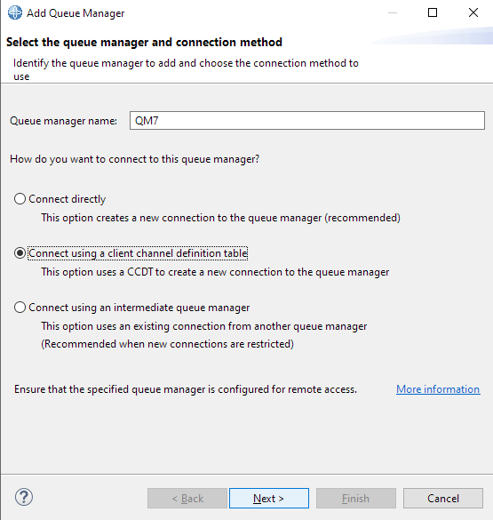
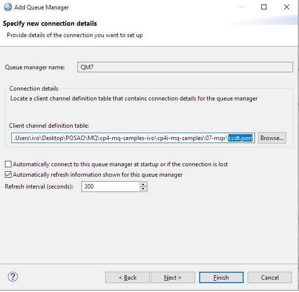
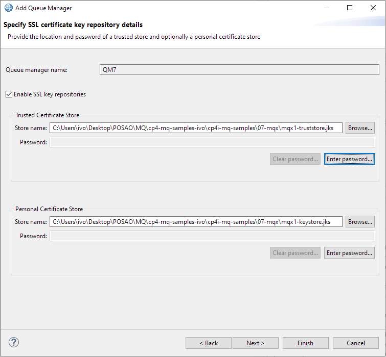
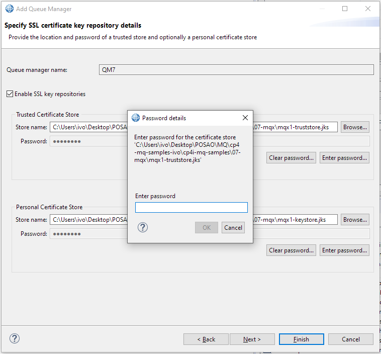
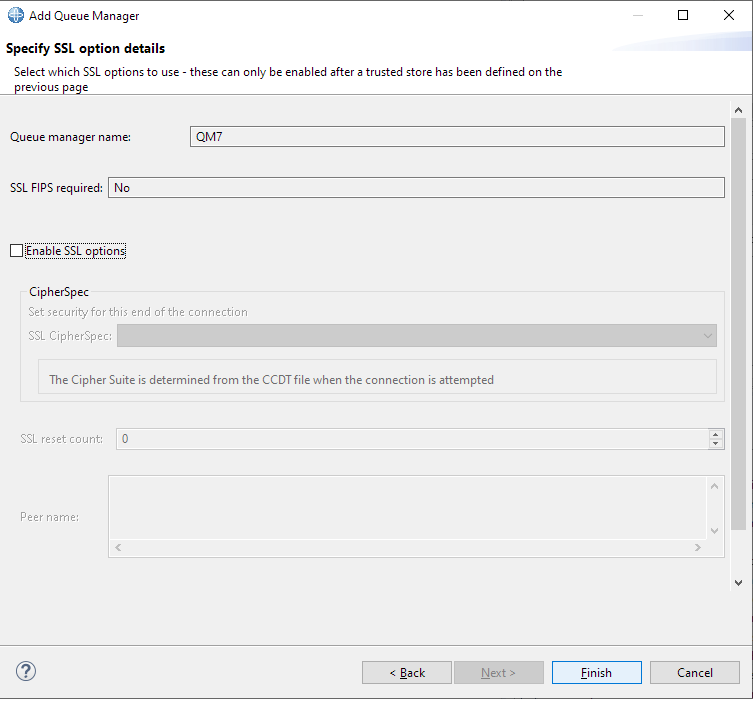
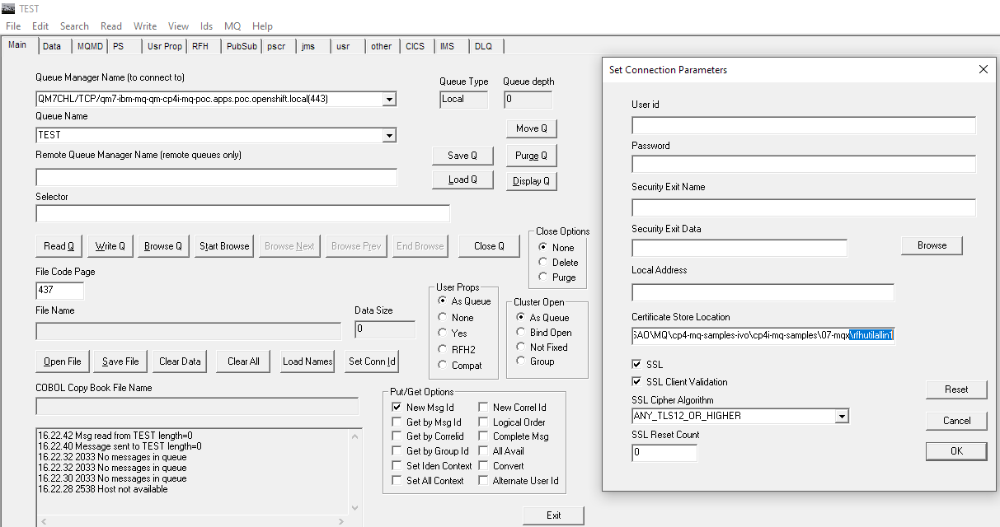

# Example: Configuring MQIPT server to provide a route to MQ Queue Manager deployed on Openshift

This example is focused on configuration of MQIPT and the client side of connection.
The MQIPT will be configured to use TLS between the MQ client and MQIPT and also to use TLS between MQIPT and the MQ Queue manager server.


## Preparation - prerequisites

The prerequisite for setting up this configuration is to first deploy a Queue Manager from example "01-tls". This is the simplest example which uses only 1-way TLS and does not use authentication and authorization on the queue manager side.

All the actions below assume that you have a running Queue manager QM1, which was created by running the "01-tls" example. It also assumes that queue manager QM1 certificate is available in the "01-tls" directory and that you are logged in to this Openshift instance.

### Clean up your work, if not running for the first time

Delete the files and resources created by this example:

```
./cleanup-qm16.sh

```

# Configure and deploy the queue manager

You can copy/paste the commands shown here to go step-by-step (suggested for first time to better understand the process), or simply run the script to execute them all [deploy-qm16-qmgr.sh](./deploy-qm16-qmgr.sh).


# Configuring the MQIPT server

The logical first choice would be to use the simplest solution - SSLProxyMode route - but it seems that the issue there is that by default, in this mode,  MQIPT forwards the OutboundSNI which is set on the client machine. The problem is that on the client machine, the OutboundSNI is set to hostname, which is the MQIPT hostname and not the MQ@Openshift hostname, so the MQ rejects that request.
The solution is to use a MQIPT route which combines both SSLClient and SSLServer.
In this case, the SSLServer part of the route is acting as a target server for our MQ client and it requires a server certificate pair to be generated and stored in the SSLServerKeyRing (keystore). The certificate public key needs to be imported to the appropriate keystore of the client (.jks for Java client , or .kdb for rfhutilc).
The SSLClient part of the route is acting as a client for the MQ server deployed on Openshift. Because of that, it needs to reference the SSLClientKeyRing (keystore) which contains the certificate public key of the certificate used by MQ server on Openshift.

This is an example of how the route can be configured:

'''
[route]
Name=TLS route with both server and client
Active=true
ListenerPort=1499
Destination=qm1-ibm-mq-qm-cp4i-mq-dev.apps.nonprod-cp4i.openshift.local
DestinationPort=443
#PasswordProtection=compatible
SSLClient=true
SSLClientCipherSuites=SSL_ECDHE_RSA_WITH_AES_128_CBC_SHA256
SSLClientKeyRing=D:\\Location\\To\\My\\Keyring\\mqiptClient.pfx
SSLClientKeyRingPW=<mqiptPW>2!+LxN+0XUkgVGphqAzGC9ZA==!e9y97gf3mU1F08rqdu/0Hh3vE6XKDboZXqapufvdwMI=
SSLClientCAKeyRing=D:\\Location\\To\\My\\Keyring\\mqiptCAkeyring.pfx
SSLClientCAKeyRingPW=<mqiptPW>2!+LxN+0XUkgVGphqAzGC9ZA==!e9y97gf3mU1F08rqdu/0Hh3vE6XKDboZXqapufvdwMI=
SSLServer=true
SSLServerAskClientAuth=false
#SSLServerProtocols=TLSv1.2
SSLServerKeyRing=D:\\Location\\To\\My\\Keyring\\mqiptServer.pfx
SSLServerKeyRingPW=<mqiptPW>2!+LxN+0XUkgVGphqAzGC9ZA==!e9y97gf3mU1F08rqdu/0Hh3vE6XKDboZXqapufvdwMI=
SSLServerCAKeyRing=D:\\Location\\To\\My\\Keyring\\mqiptCAkeyring.pfx
SSLServerCAKeyRingPW=<mqiptPW>2!+LxN+0XUkgVGphqAzGC9ZA==!e9y97gf3mU1F08rqdu/0Hh3vE6XKDboZXqapufvdwMI=
'''
Complete explanation of all MQIPT configuration parameters can be found in the Documentation :
https://www.ibm.com/docs/en/ibm-mq/9.3?topic=reference-mqipt-route-properties#ipt2190___SSLClientOutboundSNI

The KeyRingPW parameters hold the encoded version of the keyring password. To encode your own password, simply run mqiptpw command as in this example:

'''
d:\IBM\mqipt\bin>mqiptPW.bat
[Enter password]
<mqiptPW>2!SGfY8lQn2WwLTehZFMj4Qg==!ePKDZ1jmPOFwqtXp8tvJxW7daSHt63XXodLIh9FDYY0=
'''

All you need to do is to take the route snippet above, modify the parameters to fit your environment and insert it into the .conf file of your MQ IPT.
After that, start the MQ IPT and point it to your configuration (in this case, the .conf file is stored in the IPT's home directory):
'''
d:\IBM\mqipt\bin>mqipt.bat d:\IBM\mqipt -n mqipttest
'''

All that is left to do now is to try out the route, using the client of your choice.


# Connect MQ Explorer

## Add remote QMGR to MQ Explorer

1. Start MQ Explorer.

2. Right-click on `Queue Managers` (top left) and select `Add Remote Queue Manager...`


3. Enter the queue manager name (`QM15`, case sensitive) and select the `Connect using a client channel definition table` radio button. Click `Next`.



4. On the next pane (`Specify new connection details`), click `Browse...` and select the file `ccdt.json` just created. Click `Next`.



5. On `Specify SSL certificate key repository details, tick `Enable SSL key repositories`.

5.1. On `Trusted Certificate Store` click on `Browse...` and select the file `mqx1-truststore.jks`.



5.2. Select `Enter password...` and enter the trust store password (in our case, `password`).



5.3. On `Personal Certificate Store` click on `Browse...` and select the file `mqx1-keystore.jks`.

5.4. Select `Enter password...` and enter the key store password (in our case, `password`).

Click `Finish`.



You should now have a connection to your QMGR deployed on Openshift.


# Configure rfhutilc.exe to connect to the QMgr

1. Start the rfhutilc.exe.

2. Fill in the fields `Queue manager name` and `Queue name` as indicated on the image below.

3. Click on the `Set Conn Id` button and fill the form as indicated on the image below (reference your .kdb file location)



4. To test, you can push the `Write Q` button. If you get the message similar to "Message sent to TEST length=0" -> this means you have successfully configured your rfhutilc tool.

## Cleanup

This deletes the queue manager and other objects created on OpenShift, and the files created by this example:

```
./cleanup-qm15.sh

```

This is the end of this tutorial for setting up LDAP authentication and authorization.
